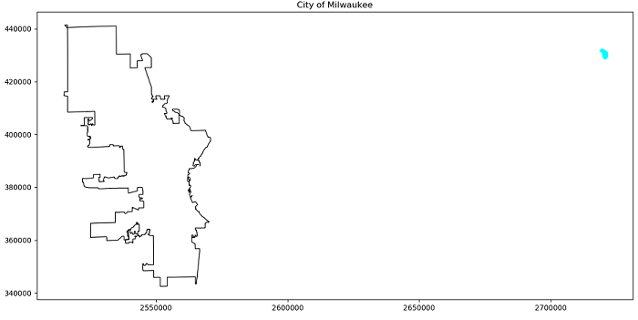

# gis_reprojection

## Background

I missed the first challenge from Daily Coding Problem, since I forgot to verify my email :sob:. So I decided to try out something I have been meaning to explore since I worked on a GIS project a few semesters ago...

While working on a side project to display open data on a GIS map of Milwaukee - [link to Python file in GitHub project](https://github.com/peterdobbs77/pop_health_mke/), I found that there are some odd differences between the way that various data sources are geospatially encoded. For example, here's one of my attempts to plot the location of registered liquor licenses around Milwaukee:

*Apparently there are some liquor stores in Lake Michigan...*

I didn't understand why the geolocations I was retrieving from Nominatim wouldn't overlay onto the shape file I got from the Milwaukee Open Data project. This frustrated me so I left it alone for a while. After a few weeks away from my frustration I stumbled upon [**this link**](https://www.earthdatascience.org/workshops/gis-open-source-python/reproject-vector-data-in-python/)! It turns out that there are different Coordinate Reference Systems (CRS) for organizing spatial data sets.

So let's get this started.

## Implementation

In the interest of time, I will be reusing some of the [code from my previous work](https://github.com/peterdobbs77/pop_health_mke/blob/0610f234bc765bbb58c732fb8836cc62598bf3e2/try_graph_liq.py).

The shape file(s) are from [Milwaukee Open Data](https://data.milwaukee.gov/). I just found a note on [this page](https://city.milwaukee.gov/DownloadMapData3497.htm#.XiC1e8hKi70) that mentions that "All shapefiles are in State Plane South NAD27." I have found that is a Coordinate Reference Systems (CRS). That CRS is different than the CRS used by OpenStreetMap (WGS-84), which I am using to get the coordinates for the addresses of the registered liquor licenses. *Progress!*

